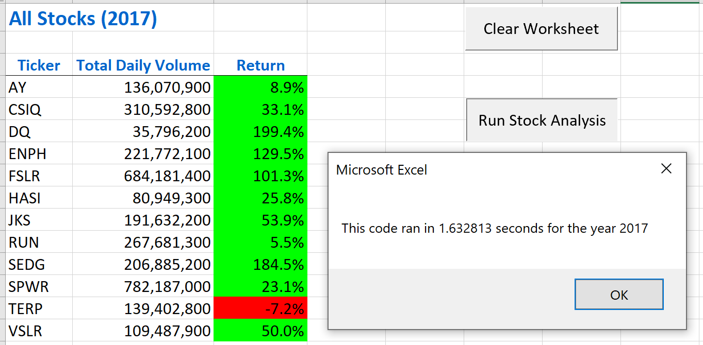
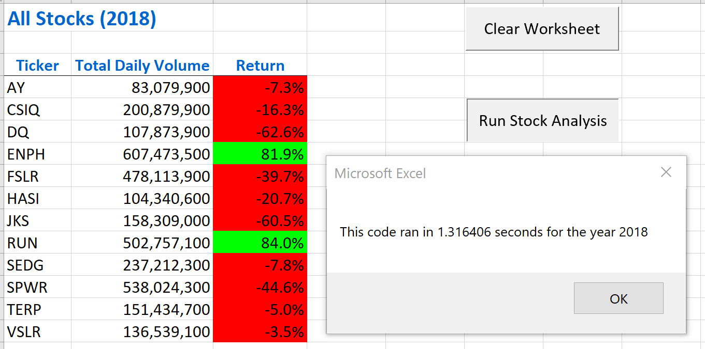

# Stock Analysis

## Table of Contents
* [Overview of Project](https://github.com/rkaysen63/stock-analysis/blob/master/README.md#overview-of-project)
* [Results](https://github.com/rkaysen63/stock-analysis/blob/master/README.md#results)
* [Summary](https://github.com/rkaysen63/stock-analysis/blob/master/README.md#summary)

## Overview of Project

The customer's parents had solely invested in DAQO New Energy Corp (DQ), a company that makes silicon wafers for solar panels.  The customer believes that his parents should diversify their investments and has asked for help analyzing 2017 and 2018 stock data in order to evaluate DQ and other green energy stocks.  Using VBA macros, the Total Daily Volume and Return were calculated for each stock for the years 2017 and 2018.

`Clear` and `Run` buttons were provided so that the customer could run the analysis quite easily by himself.  

The macros were coded twice, in different ways, in order to demonstrate refactoring and the difference in run time.

(Data set and premise from BootCamp Module 2 Challenge: https://courses.bootcampspot.com/courses)

## Results

### Analysis
Over three thousand rows of data per year were analyzed.  Total Daily Volume and Return were calculated for each ticker for each year.  The output was formatted to show gains in green and losses in red.

The side by side comparison below shows the results from two years of data.  DQ performed well in 2017 but suffered huge losses in 2018.  Enphase Energy Inc. (ENPH) and Sunrun Inc. (RUN) were the only two stocks with positive returns for both years with RUN making the most gains. 

https://www.mrexcel.com/board/threads/how-do-you-align-text-center-in-a-cell-using-vba.276160; https://docs.microsoft.com/en-us/office/vba/api/excel

### Nested Loops
To obtain the same final results, two macros were coded in different ways.  The first macro *StockAnalysis* used nested loops.  The outer loop initiated a particular ticker, set the total volume to zero and launched into the inner loop.  The inner loop circulated through a particular ticker in order to calculate Total Volume for that ticker and obtain its Starting and Ending Price.  Then the output cells were filled before moving on to the next ticker. At the next ticker, the process was repeated.

   `For i = 0 To 11; ticker = tickers(i); totalVolume = 0`
       
       For j = 2 To RowCount
        If Cells(j, 1).Value = ticker Then
          totalVolume = totalVolume + Cells(j, 8).Value
        End If
        If Cells(j - 1, 1).Value <> ticker And Cells(j, 1).Value = ticker Then
          startingPrice = Cells(j, 6).Value   
        End If
        If Cells(j + 1, 1).Value <> ticker And Cells(j, 1).Value = ticker Then
          endingPrice = Cells(j, 6).Value
        End If
       Next j
        
### Arrays

When refactored, the *StockAnalysis Refactored* macro used multiple arrays rather than nested loops.  
* First a loop was created to loop through the tickerVolumes and set them to zero.  
* A second loop was created to cycle through the arrays to calculate Ticker Volume and obtain the Starting and Ending Prices for each ticker by using a new variable called tickerIndex.  This loop ended by moving to the next ticker by increasing the tickerIndex.  
  `For i = 0 To 11; tickerVolumes(i) = 0; Next i`
   
   `For i = 2 To RowCount; tickerVolumes(tickerIndex) = tickerVolumes(tickerIndex) + Cells(i, 8).Value`
        
        If Cells(i - 1, 1).Value <> tickers(tickerIndex) And Cells(i, 1).Value = tickers(tickerIndex) Then
          tickerStartingPrices(tickerIndex) = Cells(i, 6).Value
        End If`

        If Cells(i + 1, 1).Value <> tickers(tickerIndex) And Cells(i, 1).Value = tickers(tickerIndex) Then
            tickerEndingPrices(tickerIndex) = Cells(i, 6).Value
            tickerIndex = tickerIndex + 1
        End If
    `Next i`
* A final loop populated the output.     

### Comparison of Run Times - Original Code vs Refactored Code

  
  

## Summary
1) In general, refactoring has the advantage of optimizing code and possibly reducing run time.  The obvious disadvantage is that refactoring requires additional thought and time.  The subsequent advantage of additional thought and effort is possibly learning new code or a new way to look at a problem.
2) For this particular exercise, refactoring cut the run times. The refactored run times were approximately a 10th or less of the original run times. See **Comparison of Run Times** images above. The main disadvantage to me was that it required a considerable amount of my time to understand how to use the counter variable tickerIndex.  Unlike the nested loops in the original code, the method using the arrays was not as intuitive to me. I believe that I have a better understanding of how to use arrays from this exercise. (As a side note, when I ran the original code to produce the run time images before refactoring, the run time `MsgBox` displayed 57300 sec.  It was obvious to me that run time was erroneous because it took seconds not minutes to run.  That forced me to take a look at my code to see why that may be and I realized that I had manage to delete `startTime = Timer` while removing a `call` and adding back in the code that the `call` had replaced.)
 
